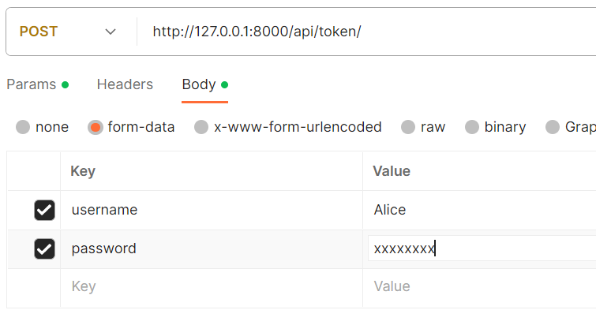

# API SoftDesk Support

***
Cette API RESTful permet de traiter les données nécessaires pour remonter et suivre des problèmes techniques au sein des des entreprises.
Ces informations peuvent être consultées ou modifiées à partir de requêtes HTTP côté client à l'aide d'une interface graphique comme Postman.

## Fonctionnalités de l'application

L’API présente quatre fonctionnalités principales :

- la gestion des utilisateurs ;
- la gestion des projets ;
- les créations des tâches et des problèmes;
- les créations des commentaires pour faciliter la communication.

## Installation

Cette API exécutable localement peut être installée en suivant les étapes décrites ci-dessous.

1. Ouvrez le terminal et tapez :

```
git clone https://github.com/Nunespace/SoftDesk-API.git
```

Vous pouvez également télécharger le code en temps qu'archive zip : [Projet_API_SoftDesk.zip](https://github.com/Nunespace/SoftDesk-API/archive/refs/heads/main.zip)

2. Placez-vous dans le répertoire SoftDesk-API :

```
CD SoftDesk-API
ou
CD chemin .../SoftDesk-API
```

3. Installez les dépendances du projet :

```
pipenv install
```

4. Démarrer le serveur avec `pipenv run python manage.py runserver`

Les étapes 1 à 3 ne sont requises que pour l'installation initiale. Pour les lancements ultérieurs du serveur de l'API, il suffit d'exécuter l'étape 4 à partir du répertoire racine du projet.

## Utilisation et documentation des points d'entrée

Selon les besoins de l'utilisateur, les requêtes HTTP utilisent les méthodes **GET** pour obtenir des données, **POST** pour en créer, **PATCH** pour les modifier ou **DELETE** pour les supprimer.

Seuls les utilisateurs authentifiés peuvent accéder aux différentes ressources et seul l'administrateur de l'API (super utilisateur) peur créer un utilisateur. Pour créer un super utilisateur : voir *Administration du site / 1.Créer votre accès superutilisateur* ci-dessous. 
Les différentes permissions sont récapitulées [sur cette page](docs/permissions.pdf)

[Postman] (https://www.postman.com/) peut être utilisé pou tester l'API : [télécharger Postman] (https://www.getpostman.com/downloads/)

L'API peut alors être interrogée à partir des points d'entrée commençant par l'url de base [http://localhost:8000/api/](http://localhost:8000/api/). Le point d'entrée principal permettant de consulter la liste des projets est [http://127.0.0.1:8000/api/projects/](http://127.0.0.1:8000/api/projects/).

Les points d'entrée sont les suivants.

### Authentification

[JWT (JSON Web Token)] (https://code.tutsplus.com/how-to-authenticate-with-jwt-in-django--cms-30460t) est utilisé pour le back-end d'authentification. 
Seul le super utilisateur peut consulter, créer, modifier, ou supprimer un accès utilisateur.
Cependant, dans le cadre du RGPD, un utilisateur authentifié peut lire, modifier ou supprimer ses données.

#### Obtention des token d'accès

- `token/`en précisant dans le corp (body) de la réquête deux clés (key) : *username* et *password*, permet d'obtenir une paire de jeton d'identification (token) : - un **access_token**  qui va permettre de vérifier l’identité et les droits de l’utilisateur. Sa durée de vie est limitée dans le temps ;
          - un **refresh_token**  qui va permettre d’obtenir une nouvelle paire de tokens une fois que l’ access_token  sera expiré.


- `token/refresh/` en précisant dans le corp (body) de la réquête la clé (key) *refresh* avec comme valeur (value) le jeton précédent, pour obtenir un nouvel **access_token** une fois que le jeton précédent est expiré.


#### Gestion des utilisateurs

- `users/` : le super utilisateur peut créer un utilisateur ou voir la liste des utilisateurs

- `users/:user_id/`[^1], le super utilisateur ou un utilisateur authentifié, s'il s'agit de lui, peut consulter, modifier ou supprimer un compte


#### Gestion des projets (Project)

- `projects/`, un utilisateur authentifié peut créer un projet (POST) ou consulter (GET) la liste des projets non détaillés.
- `projects/:project_id/`[^1] le superutilisateur ou l'auteur d'un projet peut consulter son détail (GET), le modifier(PATCH) ou le supprimer(DELETE).
- `projects/?author_id=:user_id`[^1] : un utilisateur authentifié peut consulter (GET) la liste des projets non détaillés d'un utilisateur.

### Créations des tâches et des problèmes (Issue)

- `projects/:project_id/issues/`[^1] : le superutilisateur, l'auteur ou les contributeurs d'un projet peuvent consulter (GET) la liste de ses problèmes ou créer (POST) un problème lié à celui-ci.
- `projects/:project_id/issues/:issue_id/`[^1] : ces mêmes utilisateurs peuvent consulter (GET) le détail d'un problème de ce projet. En revanche, seul l'auteur du problème ou le superutilisateur peut le modifier (PATCH) ou le supprimer (DELETE.)

### Créations des commentaires (Comment)

- `projects/:project_id/issues/:issue_id/comments/`[^1] : le superutilisateur, l'auteur ou les contributeurs d'un projet peuvent consulter (GET) la liste des commentaires d'un problème ou créer (POST) un commentaire lié à celui-ci.
- `projects/:project_id/issues/:issue_id/comments/:comment_id`[^1][^2]  : ces mêmes utilisateurs peuvent consulter (GET) le détail d'un commentaire de ce problème. En revanche, seul l'auteur du commentaire ou le superutilisateur peut le modifier (PATCH) ou le supprimer (DELETE.)

[^1]: *:user_id*  ou *:project_id*  ou *:issue_id* ou *:comment_id* matérialise l’ID de l’utilisateur, d'un projet, un problème ou un commentaire (placeholder). En pratique, avec un ID réel, le path serait par exemple :  `http://127.0.0.1:8000/api/users/14/` ou `http://127.0.0.1:8000/api/projects/4/issues/3/`

[^2]: l'id d'un commentaire est un UUID (Universally Unique IDentifier, littéralement un identifiant unique universel).
Exemple : http://127.0.0.1:8000/api/projects/4/issues/5/comments/976dcfb9-fd3a-4337-8f53-e32b157a589a/


## Administration du site

1. **Créer votre accès superutilisateur** pour la gestion du site en tapant :

```
python manage.py createsuperuser
```

puis suivez les instructions après avoir choisi un identifiant(username) et un mot de passe : Voir la [documentation officielle de Django si besoin](https://docs.djangoproject.com/fr/4.2/topics/auth/default/)

2. Après avoir démarrer le serveur local (voir *Installation/4 ci-dessus*), taper l'url suivante dans votre navigateur : <http://127.0.0.1:8000/admin/>

ou cliquer sur ce lien : [Site d'administration de Django](http://127.0.0.1:8000/admin/)

3. Entrer votre identifiant et votre mot de passe pour accéder au site d'administration de Django : ce site permet de gérer toutes les opérations [CRUD](https://openclassrooms.com/fr/courses/7172076-debutez-avec-le-framework-django/7516605-effectuez-des-operations-crud-dans-ladministration-de-django) sur les données de l'application.
