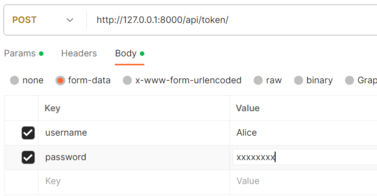

# API SoftDesk Support

***
Cette API RESTful permet de traiter les données nécessaires pour remonter et suivre des problèmes techniques au sein des entreprises.
Ces informations peuvent être consultées ou modifiées à partir de requêtes HTTP côté client à l'aide d'une interface graphique comme Postman.

## Fonctionnalités de l'application

L’API présente quatre fonctionnalités principales :

- la gestion des utilisateurs ;
- la gestion des projets ;
- les créations des tâches et des problèmes;
- les créations des commentaires pour faciliter la communication.

## Installation

Cette API exécutable localement peut être installée en suivant les étapes décrites ci-dessous. L'API aura besoin de Python, Git et Pipenv pour fonctionner. Si besoin, vous pouvez les installer en suivant les instructions sur [cette page](Docs/installation_python-git-pipenv.md).

1. Ouvrez le terminal et tapez :

```
git clone https://github.com/Nunespace/SoftDesk-API.git
```

Vous pouvez également télécharger le dossier en temps qu'archive zip : [Projet_API_SoftDesk.zip](https://github.com/Nunespace/SoftDesk-API/archive/refs/heads/main.zip)

2. Placez-vous dans le répertoire SoftDesk-API :
```
CD SoftDesk-API
ou
CD chemin .../SoftDesk-API
```

3. Installez les dépendances du projet :
```
pipenv install
```

4 . Exécuter les migrations avec cette commande :
```
pipenv run python manage.py migrate
```
5. Créer votre accès super-utilisateur en tapant :

```
pipenv run python manage.py createsuperuser
```
<sub>puis suivez les instructions après avoir choisi un identifiant(username) et un mot de passe : Voir la [documentation officielle de Django](https://docs.djangoproject.com/fr/4.2/topics/auth/default/) si besoin.

6. Démarrer le serveur avec : 
```
pipenv run python manage.py runserver
```

Les étapes 1 à 5 ne sont requises que pour l'installation initiale. Pour les lancements ultérieurs du serveur de l'API, il suffit d'exécuter l'étape 5 à partir du répertoire racine du projet.

## Documentation sur l'API REST SoftDesk

Selon les besoins de l'utilisateur, les requêtes HTTP utilisent les méthodes **GET** pour obtenir des données, **POST** pour en créer, **PATCH** pour les modifier ou **DELETE** pour les supprimer.

Seuls les utilisateurs authentifiés peuvent accéder aux différentes ressources et seul l'administrateur de l'API (super-utilisateur) peur créer un utilisateur.
Les différentes permissions sont récapitulées [sur ce tableau](Docs/permissions.pdf).

[Postman](https://www.postman.com/) peut être utilisé pou tester l'API : [télécharger Postman](https://www.getpostman.com/downloads/).

L'API peut alors être interrogée à partir des points de terminaison (endpoints) commençant par l'url de base **[http://127.0.0.1:8000/api/](http://127.0.0.1:8000/api/)**. Le point de terminaison central permettant de consulter la liste des projets est [http://127.0.0.1:8000/api/projects/](http://127.0.0.1:8000/api/projects/).

> [!NOTE]
> Des exemples de requêtes et réponses sont disponibles à [cette adresse](https://documenter.getpostman.com/view/27427921/2s9YJdUh8f).

### Authentification

[JWT (JSON Web Token)](https://code.tutsplus.com/how-to-authenticate-with-jwt-in-django--cms-30460t) est utilisé pour le back-end d'authentification. 
> [!IMPORTANT]
> Seul le super-utilisateur peut consulter, créer, modifier, ou supprimer un accès utilisateur.
Cependant, dans le cadre du RGPD, un utilisateur authentifié peut lire, modifier ou supprimer ses propres données.

#### Obtention des token d'accès

Les points de terminaison pour obtenir une paire de jeton d'identification avec la méthode "POST" sont les suivants :

- `token/`(en précisant dans le corp -body- de la réquête deux clés -key- : *username* et *password*) (token) : 
    - un **access_token**  qui va permettre de vérifier l’identité et les droits de l’utilisateur. Sa durée de vie est limitée dans le temps ;
    - un **refresh_token**  qui va permettre d’obtenir une nouvelle paire de tokens une fois que l’ access_token  sera expiré.



- `token/refresh/` en précisant dans le corp (body) de la réquête la clé (key) *refresh* avec comme valeur (value) le jeton précédent, pour obtenir un nouvel **access_token** une fois que le jeton précédent est expiré.


### Gestion des utilisateurs (User)

Les points de terminaison pour gérer les utilisateurs sont les suivants :


- `users/` : le super-utilisateur peut créer (méthode "POST") un utilisateur ou voir (méthode "GET") la liste des utilisateurs.

- `users/<user_id>/`[^1], le super-utilisateur ou un utilisateur authentifié, s'il s'agit de ses propres données, peut consulter (GET), modifier (méthode "PATCH") ou supprimer (méthode "DELETE") un compte.


### Gestion des projets (Project)

Les points de terminaison pour gérer les projets sont les suivants :

- `projects/`, un utilisateur authentifié peut créer un projet (POST) ou consulter (GET) la liste des projets non détaillés.
- `projects/<project_id>/`[^1] le super-utilisateur ou l'auteur d'un projet peut consulter son détail (GET), le modifier (PATCH) ou le supprimer (DELETE).
- `projects/?author_id=<user_id>`[^1] : un utilisateur authentifié peut consulter (GET) la liste des projets non détaillés d'un utilisateur.

### Créations des tâches et des problèmes (Issue)

Les points de terminaison pour gérer les tâches/problèmes sont les suivants :

- `projects/<project_id>/issues/`[^1] : le super-utilisateur, l'auteur ou les contributeurs d'un projet peuvent consulter (GET) la liste de ses problèmes ou créer (POST) un problème lié à celui-ci.
- `projects/<project_id>/issues/<issue_id>/`[^1] : ces mêmes utilisateurs peuvent consulter (GET) le détail d'un problème de ce projet. En revanche, seul l'auteur du problème ou le super-utilisateur peut le modifier (PATCH) ou le supprimer (DELETE.)

### Créations des commentaires (Comment)

Les points de terminaison pour gérer les commentaires sont les suivants :

- `projects/<project_id>/issues/<issue_id>/comments/`[^1] : le super-utilisateur, l'auteur ou les contributeurs d'un projet peuvent consulter (GET) la liste des commentaires d'un problème ou créer (POST) un commentaire lié à celui-ci.
- `projects/<project_id>/issues/<issue_id>/comments/<comment_id>`[^1][^2]  : ces mêmes utilisateurs peuvent consulter (GET) le détail d'un commentaire de ce problème. En revanche, seul l'auteur du commentaire ou le super-utilisateur peut le modifier (PATCH) ou le supprimer (DELETE.)


[^1]: *<user_id>*  ou *<project_id>*  ou *<issue_id>* ou *<comment_id>* matérialise l’ID de l’utilisateur, d'un projet, un problème ou un commentaire (placeholder). En pratique, avec un ID réel, le path serait par exemple :  `http://127.0.0.1:8000/api/users/14/` ou `http://127.0.0.1:8000/api/projects/4/issues/3/`

[^2]: l'id d'un commentaire est un UUID (Universally Unique IDentifier, littéralement un identifiant unique universel).
Exemple : http://127.0.0.1:8000/api/projects/4/issues/5/comments/976dcfb9-fd3a-4337-8f53-e32b157a589a/


## Administration du site

Les données de l'API peuvent être administrées par le super-utilisateur avec [le site d'administration de Django](http://127.0.0.1:8000/admin/).

1. Après avoir démarrer le serveur local (voir *Installation/6 ci-dessus*), taper l'url suivante dans votre navigateur : <http://127.0.0.1:8000/admin/>


2. Entrer votre identifiant et votre mot de passe pour accéder au site d'administration de Django : ce site permet de gérer toutes les opérations [CRUD](https://openclassrooms.com/fr/courses/7172076-debutez-avec-le-framework-django/7516605-effectuez-des-operations-crud-dans-ladministration-de-django) sur les ressources de l'API.
